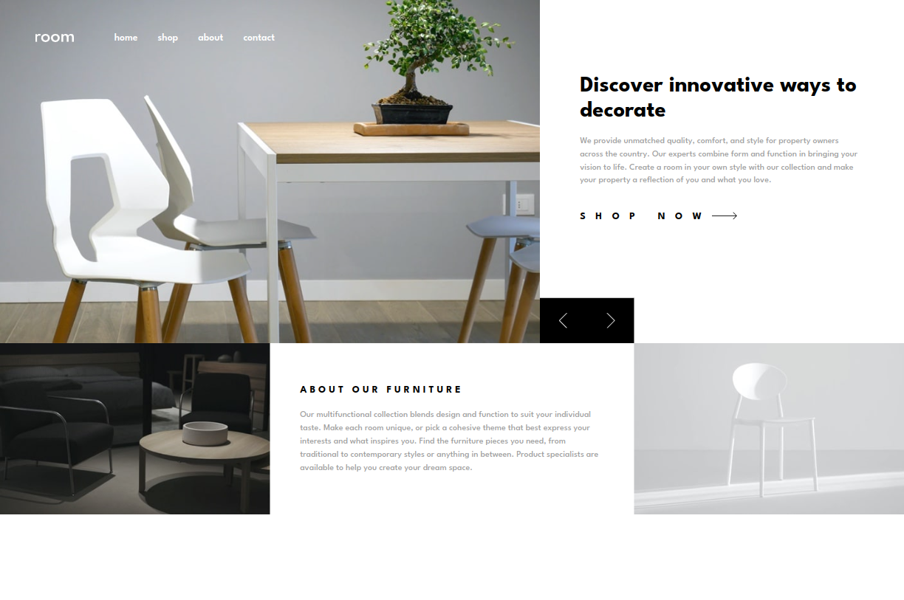
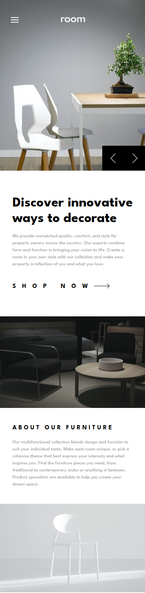

# Frontend Mentor - Room homepage solution

This is a solution to the [Room homepage challenge on Frontend Mentor](https://www.frontendmentor.io/challenges/room-homepage-BtdBY_ENq). Frontend Mentor challenges help you improve your coding skills by building realistic projects. 

## Table of contents

- [Overview](#overview)
  - [The challenge](#the-challenge)
  - [Screenshot](#screenshot)
  - [Links](#links)
  - [Built with](#built-with)
- [Author](#author)

## Overview

### The challenge

Users should be able to:

- View the optimal layout for the site depending on their device's screen size (375px and 1440px)
- See hover states for all interactive elements on the page
- Navigate the slider using either their mouse/trackpad or keyboard

### Screenshot

  

### Links

- Solution URL: (https://github.com/eduviana/Room-Homepage)
- Live Site URL: (https://room-homepage-ashy-delta.vercel.app/)

## My process

### Built with

- Semantic HTML5 markup
- Tailwind Css
- Flexbox
- CSS Grid
- Mobile-first workflow
- [React](https://reactjs.org/) - JS library

## Author

- Github - (https://github.com/eduviana)
- Frontend Mentor - (https://www.frontendmentor.io/profile/eduviana)

